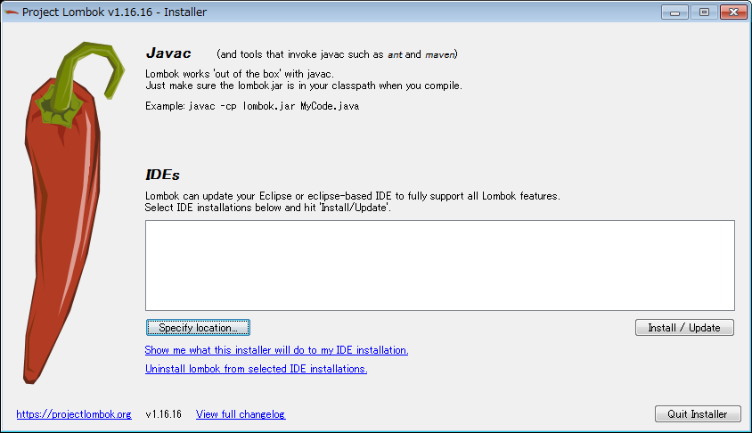
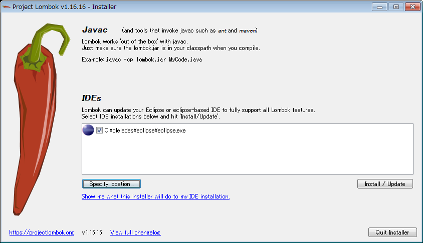
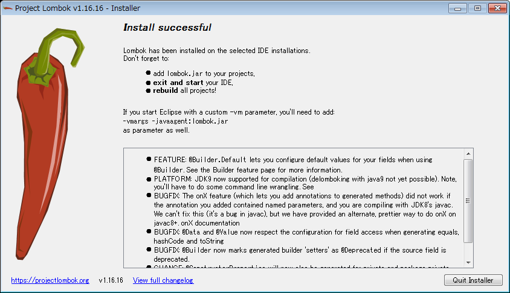
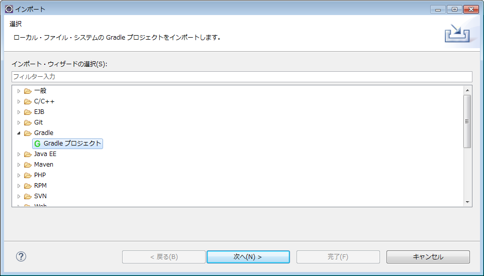
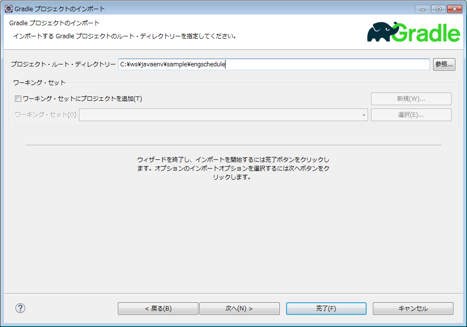
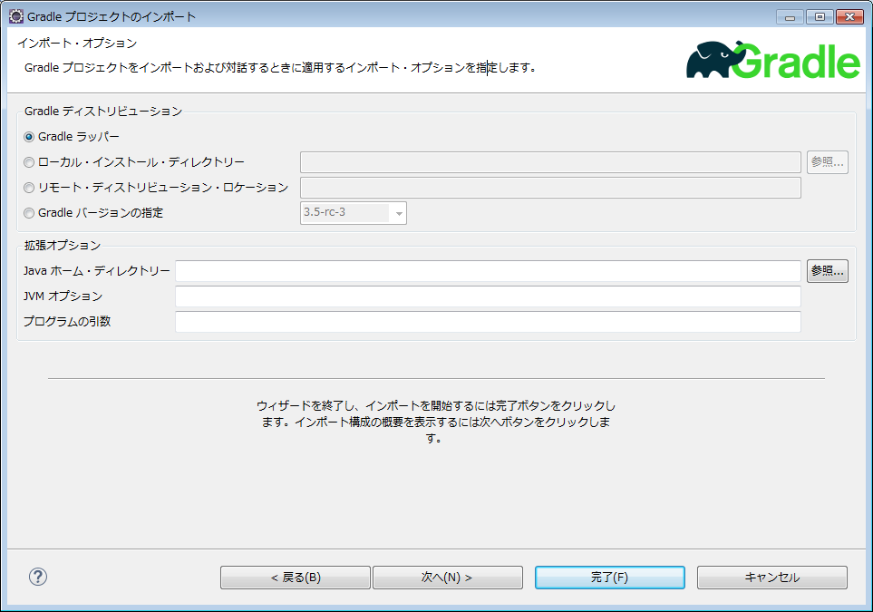
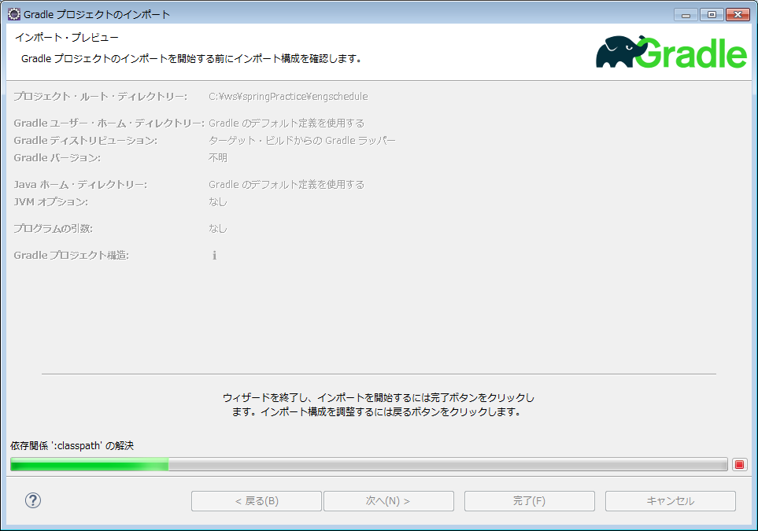
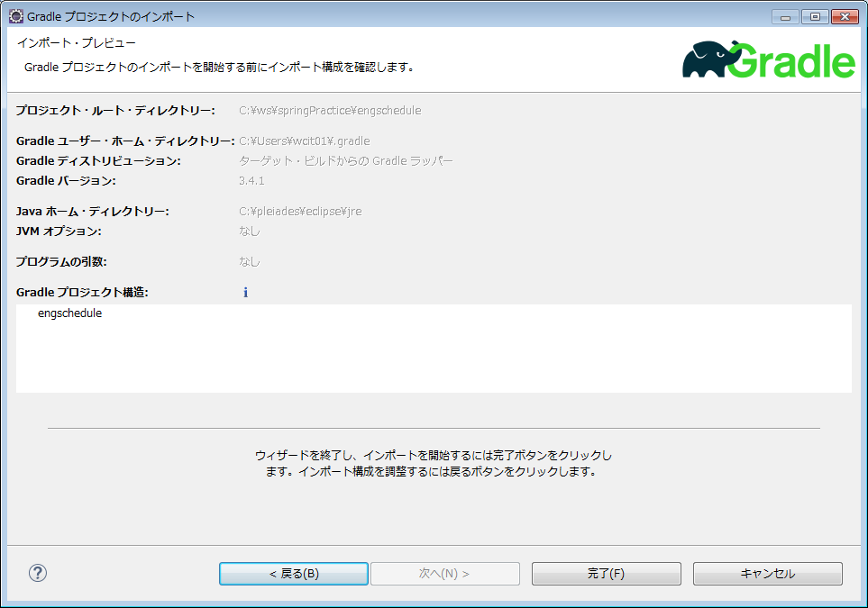

# Java開発環境作成。

Javaの開発環境作成手順を以下に示す。  
SFネットワークPCで実行すること。  

[springbootのスケルトン作成](springboot_practice.md) は別途。

<!-- TOC depthFrom:1 depthTo:6 withLinks:1 updateOnSave:1 orderedList:0 -->

- [Java開発環境作成。](#java開発環境作成)
	- [作成する環境](#作成環境)
	- [chocolateyインストール](#chocolatey)
	- [Javaインストール](#java)
	- [PostgreSQLインストール](#PostgreSQL)
	- [Eclipseのインストール](#eclipse)
	- [Ecripseでspringboot用のプラグインをインストール](#ecripsespringboot用)
		- [もしプラグインのインストールでつまずいたら…](#)
	- [lombokのインストール](#lombok)
	- [EclipseにGradleプロジェクトをインポートする。](#eclipsegradle)
		- [実行するには](#実行)

<!-- /TOC -->

## 作成する環境

Windows7上に以下をインストールする。  

* chocolatey
* cygwinとgitのインストール
* Java 8
* PostgreSQL
* Eclipse Neon
  * buildship ( https://projects.eclipse.org/projects/tools.buildship Graidle用プラグイン)
  * Spring Tool Suite ( Spring 用プラグイン )  
  * lombok ( https://projectlombok.org/ コーディングの手間が劇的に減る )

## chocolateyインストール

Windows上で動く、バージョン管理システム。yumやapt-getに似たもの。  
詳細は [chocolateyに関して](chocolatey_install.md) を参照のこと。  

1. 管理者でpoweshellを実行　　
  ```
  C:\Users\user01>powershell
  Windows PowerShell
  Copyright (C) 2009 Microsoft Corporation. All rights reserved.

  PS C:\Users\user01>
  ```
2. PowerShellスクリプトの実行ポリシーを確認  
  Unrestrictedにする。
  ```
	PS C:\Users\user01> get-executionpolicy
	Restricted
	PS C:\Users\user01>
	PS C:\Users\user01> set-executionpolicy  unrestricted
	PS C:\Users\user01>
	PS C:\Users\user01> get-executionpolicy
	Unrestricted
	PS C:\Users\user01>
  ```
3. Chocolateyインストール実行  
   警告出るけど気にしない。
  ```
  PS C:\Users\user01> iex ((New-Object System.Net.WebClient).DownloadString('https://chocolatey.org/install.ps1'))
  ```

## Javaインストール

以下は、管理者権限つきコマンドプロンプトで作業する。  

1. Chocolateyのコマンドでインストール。
  ```
  C:\Users\user01>cinst jdk8 -y
  Chocolatey v0.10.5
  Installing the following packages:
  jdk8
  By installing you accept licenses for the packages.
  Progress: Downloading jdk8 8.0.121... 100%
  　　　　・
  　　　　・
  　　　　・
  ```
2. コマンドプロンプトを開きなおして、Javaが動くかどうか確認
  ```
  C:\Users\user01>java -version
  java version "1.8.0_121"
  Java(TM) SE Runtime Environment (build 1.8.0_121-b13)
  Java HotSpot(TM) 64-Bit Server VM (build 25.121-b13, mixed mode)

  C:\Users\user01>
  C:\Users\user01>
  C:\Users\user01>javac -version
  javac 1.8.0_121

  C:\Users\user01>
  ```

## PostgreSQLインストール

chocolateyでインストールできるものは若干古いので公式から直接とってくること。  

| 項目                         | 指定            |
|:-----------------------------|:----------------|
| select your version          | PstgreSQL 9.6.2 |
| select your operating system | Windows x86-64  |


1. 以下サイトから9.6.2を取得する。  
https://www.enterprisedb.com/downloads/postgres-postgresql-downloads#windows
1. ダウンロードしてインストール。
  11. パスワードは、「Postgres1234」 にする（サンプルコードのログインパスワードに合わせる）。  
    その他はデフォルト。  
    スタックビルダは、ひとまずインストールしない。  
2. pdAdminが起動するかどうか確認。  
  スタートボタンからたどれる位置にPostgreSQL関連のソフトウェアがインストールされているので確認する。  
	ユーザ postgre 、パスワード Postgres1234 でログインできるか確認する。  

### pgAdmin4が英語版なんですけど…

上記の手順でインストールすると、最新のpgAdmin4がインストールされるが、これが英語版となる。  
まだ日本語対応されていない模様で、なにか使い勝手が微妙に違うので困るという場合はchocolateyからpdAdminⅢをとってくる（任意）。  
```
> cinst pgadmin3 -y
```
これで普通に使える。
pgAdmin4で問題なく使える方は、この操作は不要。

chocolateyでインストールできない場合は、本家からとってくる。  
[pgAdminⅢ download](https://pgadmin.org/download/windows.php)

## Eclipseのインストール

pleiades の neonを入れる。  
http://mergedoc.osdn.jp/　

1. Eclipse 4.6 Neon 3　All in One をクリック。  
2. Windows 64bit Full Edition をダウンロードする。
3. ダウンロードしてきた中身を、任意のフォルダへ解凍する。  
   `c:\pleiades\` を推奨(任意)。  
4. 実行してみる。  
   `c:\pleiades\eclipse\eclipse.exe`
5. 「タスクバーにこのプログラムを表示する」をやっておく（任意）。
6. Eclipseランチャーでワークスペースを指定する画面が出ればひとまずOK。
7. 仮のプロジェクトを用意するためのワークスペースを仮に作る。
   `C:\ws\practicews` （パスは任意）  
   「この選択をデフォルトとして使用し、今後この質問を表示しない」は **チェックしない** ほうが便利と思われる。  
8. 起動するとPythonのPATH指定が出てくるが、「すべて選択」「選択した変更を適用」を押下


## Ecripseでspringboot用のプラグインをインストール

Eclipseが起動している状態で以下の作業を実施する。  
* Gradle用のプラグインは、Eclipse公式のBuildshipとする。  
* Spring 用プラグインは、Spring Tool Suiteとする。

1. ヘルプ ー＞ Eclipseマーケットプレイス
2. 検索窓に「Gradle」と入力する。
  「Buildship Gradle Integration 」がインストール済みか確認する。
   Neonならインストールされているはず。されていなければインストール。  
3. 検索窓に「spring tool suite」と入力する。
   「Spring Tool Suite (STS) for Eclipse 」が出てくるので、インストールする。
   デフォルトでそのまま実行する。  
	 Eclipseの再起動が促されたら、素直に再起動する。

ひとまずは以上で作業終了。

### もしプラグインのインストールでつまずいたら…

もし、プラグインのインストールで、「含まれているリポジトリーが見つかりません」的なエラーが出たら、ソフトウェアサイトの更新をする。  
http://logroid.blogspot.jp/2012/05/eclipse-no-repository-found-containing.html

0. ウィンドウ　－＞　設定　－＞　インストール/更新
1. 「使用可能なソフトウェア・サイト」を選択
2. チェックの入っているものを選択して、「再ロード」をクリック。

### プラグインの自動更新につまずいたら…

Eclipseマーケットプレイスでインストールしたプラグインは、Eclipseにより自動的に更新がないかチェックされる。  
この際、「含まれているリポジトリーが見つかりません」的なエラーが出る場合がある。  
この場合も、「使用可能なソフトウェア・サイト」にて再ロードを実施する。  
もし、それでも解消されない場合は、Eclipseマーケットプレイスのインストール済みプラグインを個別に更新する。  

0. ヘルプ　－＞　Eclipseマーケットプレイス
1. 「インストール済み」タブを選択。
2. 一覧の中で、「更新」となっているものをクリックする。
3. Eclipseの再始動を促されたら素直に再指導する。

## lombokのインストール

0. https://projectlombok.org/download.html から lombok.jarを取得する。
1. lombok.jarをダブルクリックなどで起動する。起動するディレクトリはどこでもいい。  
  
2. 「Spesify location」をクリックして、Eclipse.exeのパスを指定する。
  
3. 「install / update」をクリックすると、すぐに成功画面になる。    
  

## EclipseにGradleプロジェクトをインポートする。

まず、事前にPostgreSQLで「practicedb」という名称の空のデータベースを作成する。

空のワークスペースを開いた状態で、以下の処理をする。  
このリポジトリの ./sample を取り込む場合は以下の手順を実施する。  

0. ファイル ー＞　インポート
1. 「Gradle プロジェクト」を選択して「次へ」。  
  
2. プロジェクト・ルート・ディレクトに、gradle.buildのある場所を指定して「次へ」。  
  
3. インポートオプションは、 **Gradleラッパー** を指定して「次へ」。  
  
4. インポートが始まる。  
  
5. 「完了」をクリック。  
  

### 実行するには

普通にEclipseで実行（またはデバッグ実行）し、コンソールに以下のような文字列が出れば、起動成功。
```
　　　　・
　　　　・
　　　　・
2017-04-11 17:06:34.710  INFO 7700 --- [           main] o.s.j.e.a.AnnotationMBeanExporter        : Registering beans for JMX exposure on startup
2017-04-11 17:06:34.755  INFO 7700 --- [           main] s.b.c.e.t.TomcatEmbeddedServletContainer : Tomcat started on port(s): 8080 (http)
2017-04-11 17:06:34.759  INFO 7700 --- [           main] jp.co.example.engscheduleApplication        : Started engscheduleApplication in 4.151 seconds (JVM running for 4.635)
```

この状態でブラウザで http://localhost:8080/ でアクセスできるはず。
