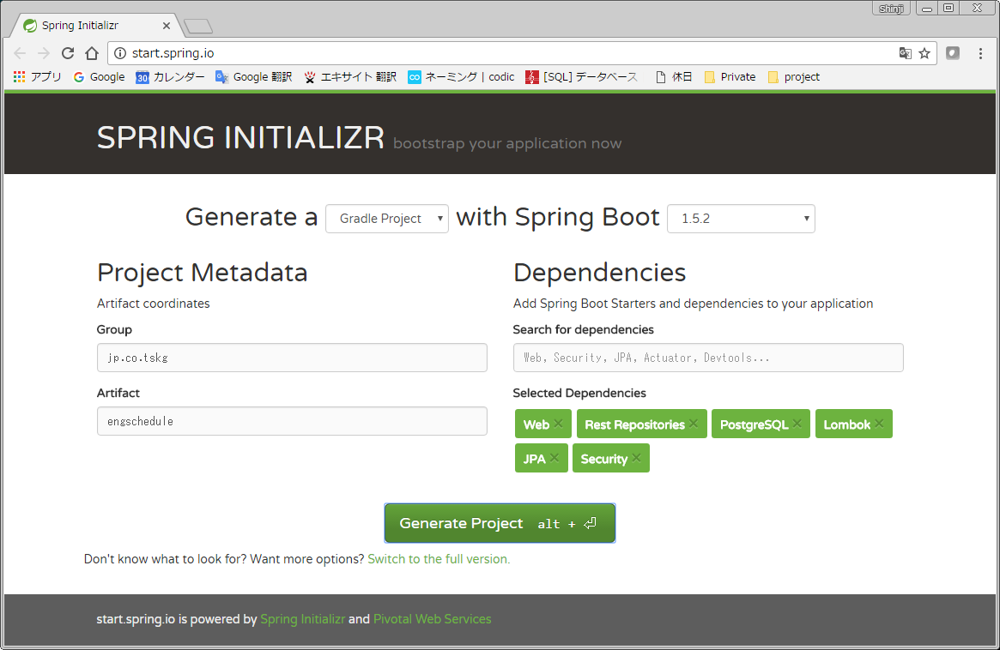

# springbootのプロジェクトを作成してみる。

本家  
https://projects.spring.io/spring-boot/

<!-- TOC depthFrom:1 depthTo:6 withLinks:1 updateOnSave:1 orderedList:0 -->

- [springbootのプロジェクトを作成してみる。](#springboot作成)
	- [スケルトン作成](#作成)
		- [もろもろ入力する。](#入力)
		- [「Generate Project 」をクリック](#generate-project-)
		- [zipを適当なフォルダに解凍する。](#zip適当解凍)
	- [設定ファイルの作成](#作変)

<!-- /TOC -->

## スケルトン作成

Spring INITIALIZER　を使用する。  
http://start.spring.io/

### パラメータを設定する。  

ひとまず試作なので、Group、Artifactは仮称とする。  

| 項目             | 設定           | 内容                                      |
|:-----------------|:---------------|:------------------------------------------|
| Generate a       | Gradle Project | Gradleで作成します。                      |
| with Spring Boot | 1.5.2          | サンプルコード作成時点の最新安定版です。             |
| Group            | jp.co.example     | パッケージ名の一部になります。仮 、小文字 |
| Artifact         | engschedule    | パッケージ名の一部になります。仮 、小文字 |

* Search for dependencies に以下を順に入力する。
  * web
  * Rest Repository
  * security
  * jpa
  * lombok
  * PostegreSql
* Selected dependencies に上記で入力したものがならんていればOK  



###  「Generate Project 」をクリック  

zipのダウンロードが始まる。  

### zipを適当なフォルダに解凍する。

zipファイルの中身は以下のような構造になっている。  
```
└─engschedule
    ├─gradle
    │  └─wrapper
    └─src
        ├─main
        │  ├─java
        │  │  └─jp
        │  │      └─co
        │  │          └─tskg
        │  └─resources
        │      ├─static
        │      └─templates
        └─test
            └─java
                └─jp
                    └─co
                        └─tskg
```
上記の例で言うと、engschedule直下に gradle.buildがあるので、Eclipseにインポートする場合は、engscheduleフォルダを指定する。

## 設定ファイルの作成

* .propertiesは面倒なので.ymlにする。  
  単純に、application.properties を application.yml にリネームするだけ。
* DBの接続情報とBasic認証の抑止を入れた設定をapplication.ymlに入れる。
	```
	spring:
	  jpa:
	    database: postgresql
	    hibernate:
	      ddl-auto: none
	  datasource:
	    url: jdbc:postgresql://localhost:5432/practicedb
	    username: postgres
	    password: Postgres1234
	    driverClassName: org.postgresql.Driver
	security:
	  basic:
	    enabled: false
	```
* ローカルにインストールしたPostgreSqlに、practicedbという名称でデータベースを作っておく。

## hello world

controller パッケージを作成し、HelloWoldController.javaを作成する。  
中身はこんな感じ  
```
package jp.co.example.controller;

import org.springframework.web.bind.annotation.RequestMapping;
import org.springframework.web.bind.annotation.RestController;

@RestController
public class HellowWolrdController {

	@RequestMapping("/")
	String home() {
		return "hello world! Ya Ya Ya!";
	}

}
```

これで実行すると、`http://localhost:8080/` で、「hello world! Ya Ya Ya!」が表示される。  
